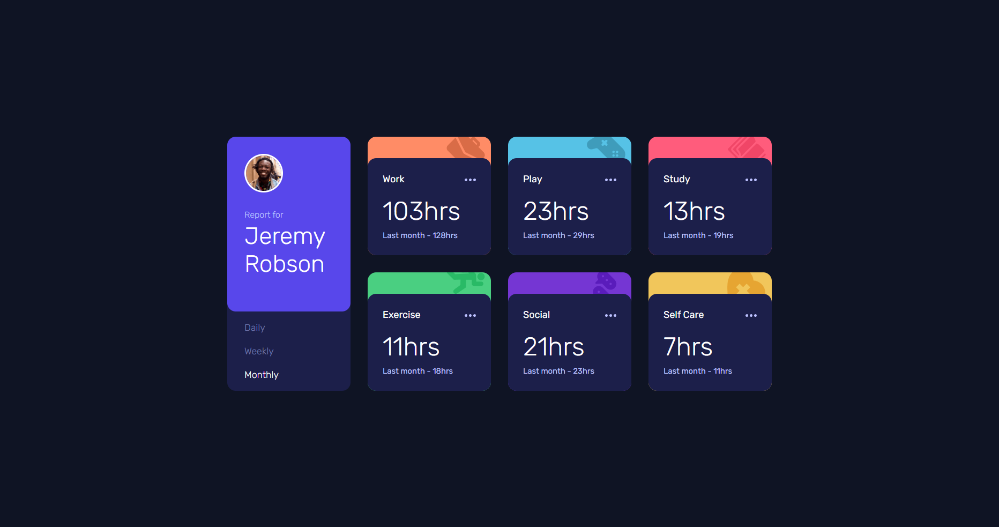

# 📱 Frontend Mentor - Solución del reto Time tracking dashboard

Esta es mi solución al reto [Time tracking dashboard en Frontend Mentor](https://www.frontendmentor.io/challenges/time-tracking-dashboard-UIQ7167Jw).

## Tabla de contenidos

- [Resumen](#resumen)
  - [El reto](#el-reto)
  - [Captura de pantalla](#captura-de-pantalla)
  - [Enlaces](#enlaces)
- [Mi proceso](#mi-proceso)
  - [Construido con](#construido-con)
  - [Lo que aprendí](#lo-que-aprendí)
  - [Desarrollo continuo](#desarrollo-continuo)
  - [Recursos útiles](#recursos-útiles)
- [Autor](#autor)
- [Agradecimientos](#agradecimientos)

## 💻 Resumen

### El reto

Los usuarios deberían poder:

- Ver la disposición óptima de la interfaz según el tamaño de pantalla del dispositivo
- Visualizar los estados _hover_ (al pasar el cursor) de todos los elementos interactivos de la página
- Cambiar las vistas entre las opciones _daily_, _weekly_ y _monthly_

### Captura de pantalla

### Enlaces

- [URL de la solución](https://github.com/angeldavid04/time-tracking-dashboard)
- [URL del sitio en vivo](https://angeldavid04.github.io/time-tracking-dashboard/)

## 💪 Mi proceso

### Construido con

- HTML5 semántico
- JavaScript ES6+
- Propiedades personalizadas de CSS
- Grid
- Flexbox
- AJAX

### Lo que aprendí

En este ejercicios reforcé mis conocimientos de asíncronía en JavaScript (**Promises**, **async - await**), empleando distintos mecanismos para hacer peticiones **AJAX**.

Para realizar la consulta de información al archivo `data.json`, hice uso de varios mecanismos a forma de práctica, estas formas las dejé comentadas dentro del mismo código. Las opciones que utilicé son:

- Uso del objeto `XMLHTTPRequest`
- La API `Fetch` nativa
- La librería `Axios`.

\*Estos dos últimos enfoques los abordé utilizando los métodos de promesas `then` y `catch`, y usando la sintaxis de funciones **async - await** para trabajar código asíncrono como síncrono.

Aunque este código puede parecer algo contraintuivo debido a que actualmente se utiliza la API fetch en su mayoría, siento que es una buena manera de aprender y reforzar la misma lógica aplicada en diferentes entornos.

### Desarrollo continuo

Me gustaría seguir aprendiendo sobre el manejo de peticiones AJAX, también a conocer formas eficientes y minimalistas de consultar, manipular y mostrar la información.

### Recursos útiles

- [MDN Web Docs](https://developer.mozilla.org/es/) - Este recurso es muy bueno y me ayuda sobre todo a escoger funciones y características que funcionan en cualquier navegador.
- [W3Schools](https://www.w3schools.com/cssref/pr_gen_quotes.php) - Este recurso me ayuda a entender las propiedades CSS cuando tengo dudas.
- [CSS Scan - CSS box shadow examples](https://getcssscan.com/css-box-shadow-examples) - Este recurso me ayuda a escoger sombras para elementos.
- [CSS Tricks](https://css-tricks.com/) - Muy buen recurso para aprender trucos útiles de maquetado.

## 🤓 Autor

- Frontend Mentor - [Angel López](https://www.frontendmentor.io/profile/angeldavid04)

## ♥️ Agradecimientos

Le quiero dar un agradecimiento a mis maestros del bachillerato y la universidad porque sin ellos no fuera quien soy ahora, JonMircha por ser un gran docente digital y por enseñarme los fundamentos del maravilloso mundo del desarrollo web, Lucas Dalto por ofrecerme muy buenos cursos para aprender y repasar.
